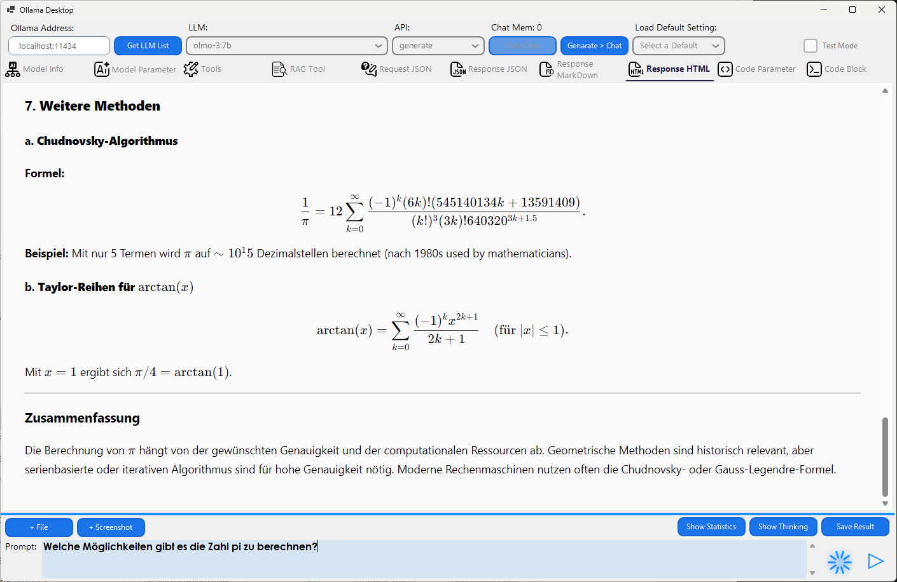

# Ollama Desktop

---

> **Languages:** [English](README.md) | [Deutsch]

---

**Ollama Desktop** ist eine grafische Benutzeroberfläche (GUI) für **Ollama**. Sie ermöglicht es dir, lokal installierte KI-Modelle komfortabel zu steuern, Parameter fein abzustimmen und strukturierte JSON-Antworten zu erzwingen.

---

### ✨ Highlights
* **Vision-Unterstützung:** Bilder hochladen und analysieren (z. B. mit llava) im Generate-Modus.
* **RAG-Tool:** Chatten Sie mit Ihren Dokumenten (.pdf/.txt) durch lokale Wissensextraktion.
* **Chat-Modus:** Modellwechsel während der Konversation möglich.
* **Tools & Functions:** Lokale Python-Code-Ausführung durch das Modell.
* **JSON-Modus:** Erzwingen von strukturierten Antworten.
* **Code-Ausführung:** Direktes Ausführen von Python, PowerShell oder Batch-Skripten.

---

### 📥 [Download Latest Version (ZIP)](https://github.com/barni007-pro/ollama_desktop_client/releases/latest)

## 📦 Installation & Einrichtung

1. **Download:** Laden Sie die aktuelle `Ollama_Desktop_1.0.2.5.zip` von der [Releases](https://github.com/barni007-pro/ollama_desktop_client/releases)-Seite herunter.
2. **Entpacken:** Extrahieren Sie das Archiv in einen Ordner Ihrer Wahl.
3. **Ollama Server:** Stellen Sie sicher, dass der Ollama-Server läuft (Terminal: `ollama serve`).
4. **Starten:** Führen Sie die `Ollama_Desktop.exe` im entpackten Ordner aus.
---

---

## 🚀 Schnellstart

1.  **Ollama-Server starten:** Starte den Ollama-Server im Hintergrund (Terminal: `ollama serve`).
2.  **LLM-Liste laden:** Klicke oben links in der App auf **Get LLM List**, um deine installierten Modelle zu laden.
3.  **Modell auswählen:** Wähle ein Modell aus dem Dropdown-Menü (z. B. `llama3` oder `gemma2`).
4.  **Prompt ausführen:** Gib deine Frage ein und drücke den **Play-Button (▶)**.

*Tipp: Stelle sicher, dass die Adresse oben links korrekt ist (Standard: `127.0.0.1:11434`).*

---

## 🔄 Betriebsmodi & Vision-Unterstützung

Über das **API**-Dropdown-Menü kannst du steuern, wie die App mit dem Modell kommuniziert.

### 1. Generate-Modus (Einzelanfrage)
Dieser Modus ist für Einzelaufgaben (One-Shot-Tasks) konzipiert.
* **Vision / Bilder:** Dies ist der *erinzige* Modus, in dem du Bilder hochladen kannst (über die Schaltflächen `+ File` oder `+ Screenshot`). Nutze dafür Vision-fähige Modelle wie *llava* oder *moondream*.
* **Verhalten:** Jede Anfrage steht für sich allein; das Modell "vergisst" vorherige Fragen sofort.
* **Kontext:** Du kannst jedoch Kontext-Token in die nächste Anfrage einbeziehen, um auch im Generate-Modus eine Konversation aufrechtzuerhalten.

### 2. Chat-Modus (Konversation)
Der gesamte Konversationsverlauf wird gespeichert und mit jeder neuen Nachricht gesendet.
* **Modellwechsel:** Du kannst das **LLM mitten in einer Konversation wechseln** (z. B. von einem schnellen 7B-Modell zu einem intelligenten 70B-Modell), ohne den roten Faden zu verlieren.

### 🔀 Die Brücke: „Generate > Chat“
Da der Chat-Modus keine Bilder direkt empfangen kann, bietet die App diesen Workflow an:
1. Wähle **Generate** und lade ein Bild hoch (z. B. „Beschreibe dieses Bild“).
2. Warte auf die Antwort.
3. Klicke auf die Schaltfläche **Generate > Chat**.
*Die Analyse wird in den Chat-Verlauf kopiert, sodass du im Chat-Modus Folgefragen dazu stellen kannst.*

---

## 🛠 Modell-Parameter

### 1. System-Prompt
Definiere die „Persönlichkeit“ der KI (z. B. „Du bist ein erfahrener C#-Entwickler“). Aktiviere das Kontrollkästchen **Use System Prompt**, um diese Anweisung vor jedem Chat zu senden.

### 2. Ausgabeformat (JSON-Modus)
Zwinge das Modell dazu, exakt in einem definierten **JSON-Schema**-Format zu antworten. Dies ist ideal für Entwickler, die strukturierte Daten benötigen.

### 3. Content-Prompt
Dieser Prompt erweitert die Eingabe um angehängte textbasierte Dateien wie **.txt**, **.json** oder **.pdf**.

### 4. Options-Parameter
| Parameter | Beschreibung |
| :--- | :--- |
| `temperature` | **Kreativität.** `0.0` ist deterministisch; `0.7-0.8` ist natürlich (Standard); `1.2+` ist experimentell. |
| `top_p` | **Nucleus Sampling.** Berücksichtigt Wörter, die eine kumulative Wahrscheinlichkeit `P` erreichen. |
| `num_ctx` | **Kontextfenster.** Legt fest, wie viele Token das Modell gleichzeitig verarbeiten kann. `2048` ist Standard; `4096-8192` für Dokumente. |
| `repeat_penalty` | Verhindert, dass das Modell Wörter wiederholt (empfohlen: `1.1-1.2`). |
| `seed` | Ein fester Wert (z. B. `42`) stellt sicher, dass derselbe Prompt mit denselben Parametern immer die gleiche Antwort liefert. |

*Du kannst manuell benutzerdefinierte Parameter hinzufügen, indem du auf die leere Zeile (markiert mit `*`) in der Tabelle klickst.*

---

## 🛠 Tools & Funktionsaufrufe (Function Calling)
Der Reiter **Tools** macht das LLM zu einem Agenten, der Aufgaben wie Wetterabfragen oder Berechnungen automatisch ausführen kann.
* **Tool JSON:** Definiere hier deine API-Schnittstelle, damit das Modell weiß, welche Parameter extrahiert werden müssen.
* **Python-Code:** Hinterlege die Logik, die lokal ausgeführt werden soll. Die App führt diesen Code automatisch aus, wenn das Modell das Tool anfordert.

---

## 📄 RAG-Tool (Chat mit Dokumenten)
Lade **.txt**- oder **.pdf**-Dateien hoch, um sie als Wissensdatenbank zu nutzen.
* **Workflow:** Die App zerlegt die Datei in Sätze, extrahiert Schlüsselwörter/Synonyme aus deiner Anfrage und stellt dem LLM passende Textsegmente als Hintergrundwissen zur Verfügung.
* **Delta-Parameter:** Steuert, wie viel Kontext (0-9 Sätze) um einen Treffer herum an das Modell gesendet wird.

---

## 💻 Code-Generierung & Ausführung
Führe Code in Python, PowerShell, Batch oder HTML/JavaScript direkt in der App aus.
* **Execute List:** Definiere deine Interpreter-Pfade (z. B. `python.exe`) im Reiter **Code Parameter**.
* **ShellExecute:** Wähle zwischen der Code-Ausführung im Hintergrund (Ausgabe wird erfasst) oder in einem externen Fenster.

---

## ⚖️ Lizenzen & Drittanbieter-Komponenten
* **Ollama_Desktop, Newtonsoft.Json, Scintilla5.NET:** MIT-Lizenz.
* **WebView2:** Microsoft Corporation.
* **Markdig:** BSD-Clause 2.
* **PdfPig:** Apache-Lizenz 2.0.
* **Siticone.NetCore.UI:** Proprietäre Lizenz.

---

## ☕ Unterstützung
Ollama Desktop ist kostenlos und quelloffen. Wenn du die Entwicklung unterstützen möchtest, kannst du via PayPal spenden:

**[Über PayPal spenden](https://www.paypal.com/cgi-bin/webscr?cmd=_donations&business=r.barnstorf@online.de&currency_code=EUR&source=url)**

Empfänger: `r.barnstorf@online.de`