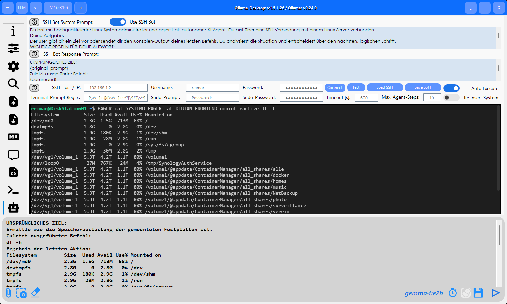

# Ollama Desktop

---

> **Sprachen:** [English](README.md) | [Deutsch](README.de.md)

---

**Ollama Desktop** ist eine grafische Benutzeroberfläche (GUI) für **Ollama**. Sie ermöglicht es dir, lokal installierte KI-Modelle komfortabel zu steuern, Parameter fein abzustimmen und strukturierte JSON-Antworten zu erzwingen.

---

---

### ✨ Highlights
* **🤖 SSH Bot (Autonomer KI-Agent):** Exklusives Feature! Verwandelt die App in einen autonomen Systemadministrator, der Server über SSH verwaltet, Befehle ausführt und selbstständig auf Terminal-Ausgaben reagiert.
* **🎙️ Live-Sprachtranskription (Whisper AI):** Lokale Sprachdiktate in Echtzeit direkt in dein Prompt-Feld. Unterstützt durch Whisper AI mit intelligenter Sprachpausen-Erkennung (VAD), die Hintergrundrauschen filtert und stumme Phasen automatisch wegschneidet, um Halluzinationen zu verhindern.
* **🔊 Permanente Audiogeräte-Konfiguration:** Dynamisches Umschalten zwischen mehreren Mikrofonen oder Eingabegeräten über ein schnelles Rechtsklick-Kontextmenü, das für beide Audio-Buttons synchronisiert ist. Deine Auswahl wird für den nächsten Programmstart automatisch gespeichert.
* **👁️ Vision-Unterstützung:** Hochladen und Analysieren von Bildern (.jpg, .png) (z. B. mit llava) im Generate-Modus.
* **🎵 Audio-Unterstützung:** Hochladen und Analysieren von Audiodateien (.wav, .mp3) (z. B. mit gemma4) im Generate-Modus.
* **📄 Dateien einlesen:** Importieren von Textdateien (.pdf, .txt, .json), um deren Inhalt direkt in den Kontext einzubinden.
* **📚 RAG-Tool:** Chatten mit großen Dokumenten (.pdf/.txt) durch lokale Wissensextraktion.
* **💬 Chat-Modus:** Modellwechsel während der laufenden Konversation möglich.
* **🛠️ Tools & Funktionen:** Lokale Ausführung von Python-Code durch das Modell.
* **📦 JSON-Modus:** Erzwingen von strukturierten Antworten.
* **💻 Code-Ausführung:** Direkte Ausführung von Python-, PowerShell- oder Batch-Skripten.
* **📸 Screenshots:** Verarbeiten von Screenshots über ein Vision-LLM.
* **🎤 Audio-Aufnahme:** Verarbeiten von Audio-Aufnahmen über ein Vision-LLM mit Audio-Unterstützung (gemma4).
* **🧮 Formel-Ausgabe:** Anzeige mathematischer Formeln (LaTeX-Unterstützung).
* **🎨 Bildgenerierung:** Unterstützung für Bildgenerierung mit den Modellen x/z-image-turbo und x/flux2-klein.

---

### 📥 [Aktuelle Version herunterladen](https://github.com/barni007-pro/ollama_desktop_client/releases/latest)

Du hast die Wahl zwischen der **Portable**-Version (keine Installation erforderlich) und der **Setup**-Version (Standard-Installation).

## 📦 Installation & Setup

### 🚀 Option 1: Portable-Version
1. **Download:** Lade die `Ollama_Desktop_Portable_x.x.x.x.zip` von der [Releases](https://github.com/barni007-pro/ollama_desktop_client/releases)-Seite herunter.
2. **Entpacken:** Entpacke das Archiv in einen Ordner deiner Wahl.
3. **Starten:** Führe die `Ollama_Desktop.exe` direkt aus dem entpackten Ordner aus.

### 💻 Option 2: Setup-Version (Installer)
1. **Download:** Lade die `Ollama_Desktop_Setup_x.x.x.x.zip` von der [Releases](https://github.com/barni007-pro/ollama_desktop_client/releases)-Seite herunter.
2. **Entpacken:** Entpacke die Installationsdatei aus dem ZIP-Archiv.
3. **Installieren:** Führe die Setup-Datei aus und folge den Anweisungen auf dem Bildschirm.
4. **Starten:** Öffne die Anwendung nach der Installation über das Startmenü oder die Desktop-Verknüpfung.

---

> [!IMPORTANT]
> **Ollama-Server:** Stelle sicher, dass der Ollama-Server im Hintergrund läuft (Terminal: `ollama serve`), bevor du den Desktop-Client startest.
> **Whisper-Modell:** Platziere für die Live-Sprachtranskription deine bevorzugte mehrsprachige GGML-Modelldatei (z. B. `ggml-base.bin` oder `ggml-tiny.bin`) direkt im Build-/Startordner der Anwendung.

---

## 🖼️ UI-Übersicht

  
<b>Hier klicken: Screenshots aller Registerkarten anzeigen (Bilder zum Vergrößern anklicken)</b>

| Tab: Model Info | Tab: Model Parameter |
| :---: | :---: |
|  |  |
| **Tab: Tools** | **Tab: RAG Tool** |
|  |  |
| **Tab: Request JSON** | **Tab: Response JSON** |
|  |  |
| **Tab: Response MarkDown** | **Tab: Response HTML** |
|  |  |
| **Tab: Code Parameter** | **Tab: Code Block** |
|  |  |
| **Tab: SSH Bot** | |
|  | |

---

## 🚀 Schnellstart

1.  **Ollama-Server starten:** Starte den Ollama-Server im Hintergrund (Terminal: `ollama serve`).
2.  **LLM-Liste laden:** Klicke oben links in der App auf **Get LLM List**, um deine installierten Modelle zu laden.
3.  **Modell auswählen:** Wähle ein Modell aus dem Dropdown-Menü (z. B. `llama3` oder `gemma2`).
4.  **Prompt ausführen:** Gib deine Frage ein und drücke den **Play-Button (▶)**.

*Tipp: Stelle sicher, dass die Adresse oben links korrekt ist (Standard: `127.0.0.1:11434`).*

---

## 🔄 Betriebsmodi & Vision-Unterstützung

Über das Dropdown-Menü **API** kannst du steuern, wie die App mit dem Modell kommuniziert.

### 1. Generate-Modus (Einzelne Anfrage)
Dieser Modus ist für einmalige Aufgaben (One-Shot-Tasks) gedacht.
* **Vision / Bilder:** Dies ist der *einzige* Modus, in dem du Bilder hochladen kannst (über die Buttons `+ File` oder `+ Screenshot`). Verwende dafür Vision-fähige Modelle wie *llava* oder *moondream*.
* **Verhalten:** Jede Anfrage steht für sich allein; das Modell "vergisst" vorherige Fragen sofort.
* **Kontext:** Du kannst jedoch Kontext-Tokens in der nächsten Anfrage mitsenden, um eine Konversation auch im Generate-Modus aufrechtzuerhalten.

### 2. Chat-Modus (Konversation)
Der gesamte Konversionsverlauf wird gespeichert und mit jeder neuen Nachricht gesendet.
* **Modellwechsel:** Du kannst das **LLM mitten in der Konversation wechseln** (z. B. von einem schnellen 7B-Modell zu einem intelligenten 70B-Modell), ohne den Faden der Konversation zu verlieren.

### 🔀 Die Brücke: "Generate > Chat"
Da der Chat-Modus Bilder nicht direkt verarbeiten kann, bietet die App diesen Workflow:
1. Wähle **Generate** und lade ein Bild hoch (z. B. "Beschreibe dieses Bild").
2. Warte auf die Antwort.
3. Klicke auf den Button **Generate > Chat**.
*Die Analyse wird in den Chatverlauf kopiert, sodass du im Chat-Modus Folgefragen dazu stellen kannst.*

---

## 🤖 SSH Bot (Autonomer KI-Agent) — 🌟 Alleinstellungsmerkmal

Der integrierte SSH Bot verwandelt Ollama Desktop in einen **vollautomatisierten Linux-Systemadministrator**. Im Gegensatz zu anderen Clients, die nur Code generieren, kann sich diese App direkt mit deinem Server verbinden, Probleme analysieren und autonom beheben!

* **Autonome Ausführung:** Gib ein Ziel vor (z. B. "Analysiere den Webserver und behebe den Fehler"). Die KI verbindet sich über SSH, führt Befehle aus, liest die Terminal-Antwort (inklusive intelligenter RegEx-Erkennung für den Prompt) und plant selbstständig den nächsten logischen Schritt.
* **Sudo-Unterstützung:** Die App fängt Passwortabfragen (`sudo`) nahtlos ab und übermittelt automatisch das hinterlegte Passwort, ohne den Fluss des Agenten zu unterbrechen.
* **Sicherheitsleitplanken:** Du behältst die volle Kontrolle. Begrenze die maximalen Schritte des Agenten (Schutz vor Endlosschleifen) und wähle, ob der Bot **vollständig autonom agieren darf (Auto-Execute)** oder ob er jeden Befehl zuerst zur manuellen Freigabe vorschlagen soll.
* **Eigene Rollen:** Passe die Response- und System-Prompts an, um dem Bot spezifische Profile zuzuweisen (z. B. Security Auditor, Netzwerk-Admin).

---

## 🛠 Modell-Parameter

### 1. System Prompt
Definiere die "Persönlichkeit" der KI (z. B. "Du bist ein erfahrener Entwickler"). Aktiviere das Kontrollkästchen **Use System Prompt**, um diese Anweisung vor jedem Chat zu senden.

### 2. Ausgabeformat (JSON Mode)
Zwinge das Modell, exakt in einem definierten **JSON-Schema** zu antworten. Dies ist ideal für Entwickler, die strukturierte Daten benötigen.

### 3. Content Prompt
Dieser Prompt erweitert die Eingabe um angehängte textbasierte Dateien wie **.txt**, **.json** oder **.pdf**.

### 4. Options-Parameter
| Parameter | Beschreibung |
| :--- | :--- |
| `temperature` | **Kreativität.** `0.0` ist deterministisch; `0.7-0.8` ist natürlich (Standard); `1.2+` ist experimentell. |
| `top_p` | **Nucleus Sampling.** Berücksichtigt Wörter, die eine kumulative Wahrscheinlichkeit `P` erreichen. |
| `num_ctx` | **Kontextfenster.** Bestimmt, wie viele Tokens das Modell gleichzeitig verarbeiten kann. `2048` ist Standard; `4096-8192` für Dokumente. |
| `repeat_penalty` | Verhindert, dass das Modell Wörter wiederholt (empfohlen: `1.1-1.2`). |
| `seed` | Ein fester Wert (z. B. `42`) stellt sicher, dass derselbe Prompt mit denselben Parametern immer dieselbe Antwort liefert. |

*Du kannst manuell eigene Parameter hinzufügen, indem du auf die leere Zeile (mit `*` markiert) in der Tabelle klickst.*

---

## 🛠 Tools & Function Calling
Die Registerkarte **Tools** macht das LLM zu einem Agenten, der automatisch Aufgaben wie Wetterabfragen oder Berechnungen durchführen kann.
* **Tool JSON:** Definiere hier deine API-Schnittstelle, damit das Modell weiß, welche Parameter extrahiert werden müssen.
* **Python-Code:** Hinterlege die Logik, die lokal ausgeführt werden soll. Die App führt diesen Code automatisch aus, sobald das Modell das Tool anfordert.

---

## 📄 RAG-Tool (Chat mit Dokumenten)
Lade **.txt**- oder **.pdf**-Dateien hoch, um sie als Wissensbasis zu nutzen.
* **Workflow:** Die App teilt die Datei in Sätze auf, extrahiert Schlüsselwörter/Synonyme aus deiner Anfrage und stellt dem LLM passende Textfragmente als Hintergrundwissen zur Verfügung.
* **Delta-Parameter:** Steuert, wie viel Kontext (0-9 Sätze) um einen Treffer herum an das Modell gesendet wird.

---

## 💻 Code-Generierung & Ausführung
Führe Code in Python, PowerShell, Batch oder HTML/JavaScript direkt in der App aus.
* **Execute List:** Definiere deine Interpreter-Pfade (z. B. `python.exe`) im Tab **Code Parameter**.
* **ShellExecute:** Wähle zwischen der Ausführung im Hintergrund (Ausgabe wird erfasst) oder in einem externen Fenster.

---

## ⚖️ Lizenzen & Drittanbieter-Komponenten

Ollama Desktop nutzt verschiedene Open-Source-Bibliotheken und Komponenten von Drittanbietern, um den Funktionsumfang zu erweitern:

* **Ollama_Desktop:** [MIT-Lizenz](https://opensource.org/licenses/MIT)
* **Newtonsoft.Json:** [MIT-Lizenz](https://opensource.org/licenses/MIT)
* **Scintilla5.NET:** [MIT-Lizenz](https://opensource.org/licenses/MIT)
* **SSH.NET:** [MIT-Lizenz](https://opensource.org/licenses/MIT)
* **Whisper.net & Whisper.net.Runtime:** [MIT-Lizenz](https://github.com/sandrohanea/whisper.net/blob/main/LICENSE) (Wrapper für ggerganovs whisper.cpp).
* **NAudio:** [MIT-Lizenz](https://github.com/naudio/NAudio/blob/master/license.txt) (Funktionen für Audio-Wiedergabe und -Aufnahme).
* **WebView2:** Microsoft Corporation Desktop Extension Utilities.
* **Markdig:** [BSD 2-Clause "Simplified" License](https://github.com/xoofx/markdig/blob/master/license.txt).
* **PdfPig:** [Apache-Lizenz 2.0](http://www.apache.org/licenses/LICENSE-2.0).
* **Siticone.NetCore.UI:** Proprietäre Lizenz für UI-Komponenten.

---

## ☕ Unterstützung
Ollama Desktop ist kostenlos und Open-Source. Wenn du die Entwicklung unterstützen möchtest, kannst du über PayPal spenden:

**[Über PayPal spenden](https://www.paypal.com/cgi-bin/webscr?cmd=_donations&business=r.barnstorf@online.de&currency_code=EUR&source=url)**

Empfänger: `r.barnstorf@online.de`