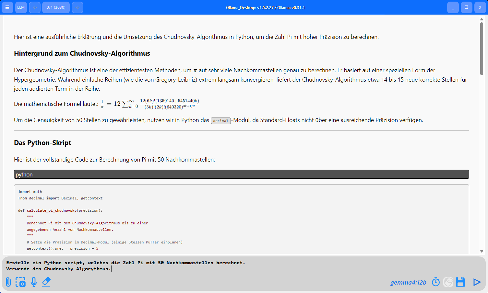
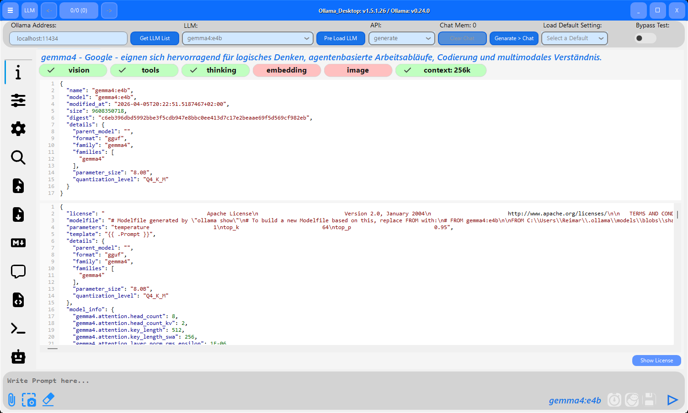
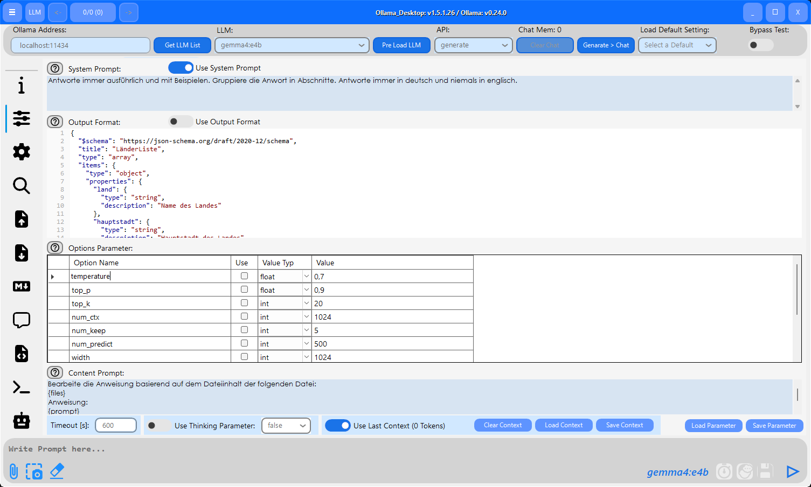
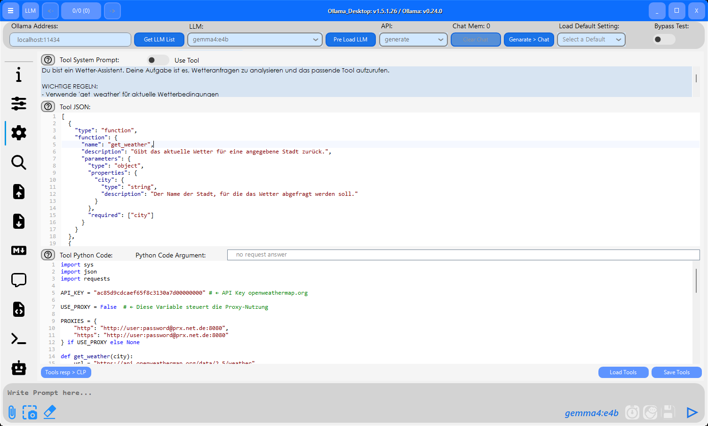
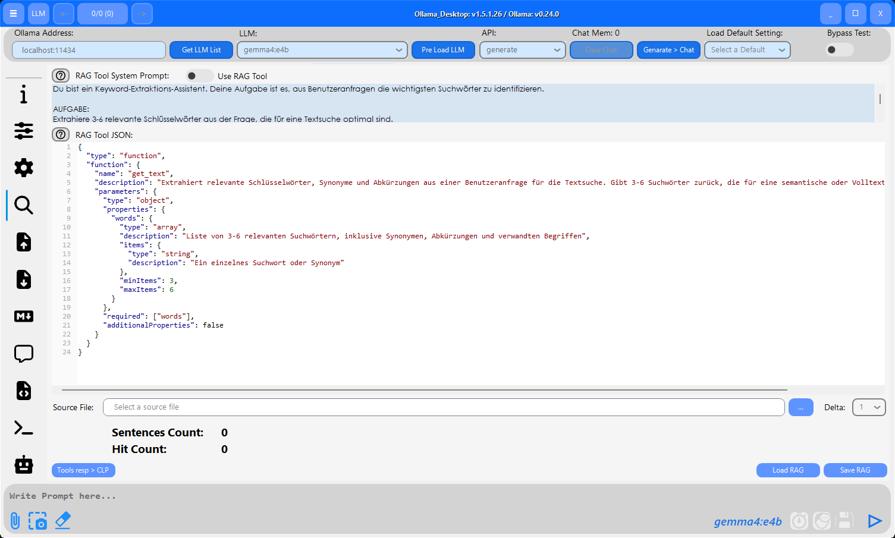
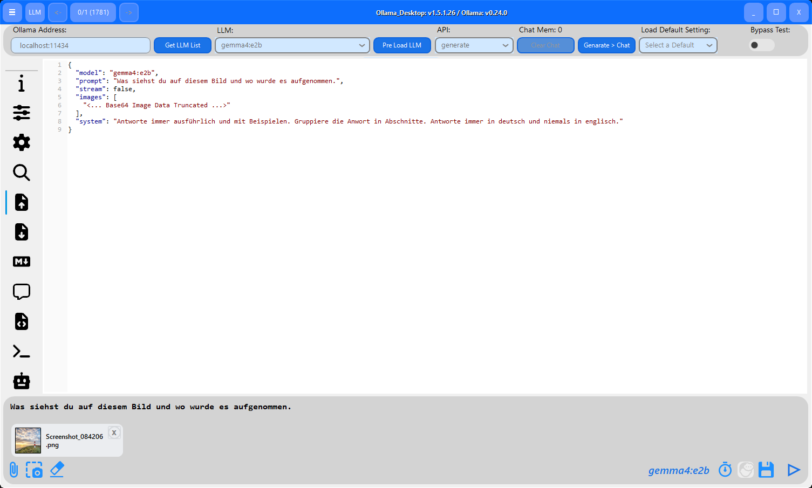
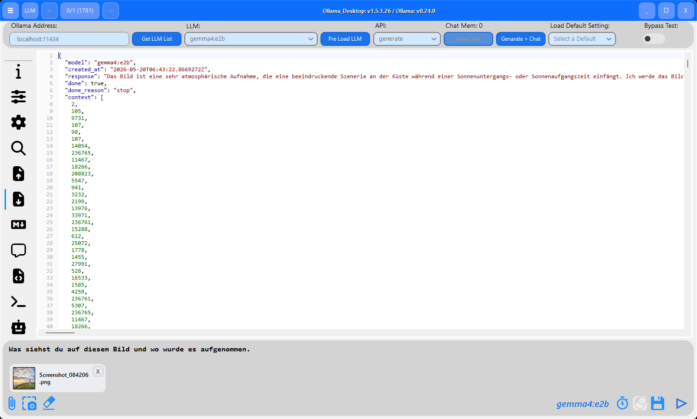
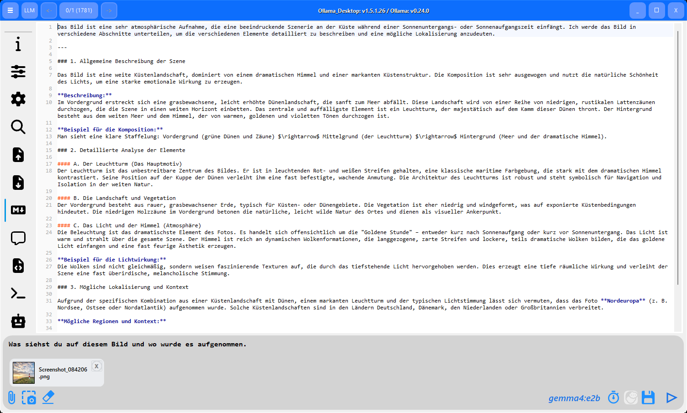
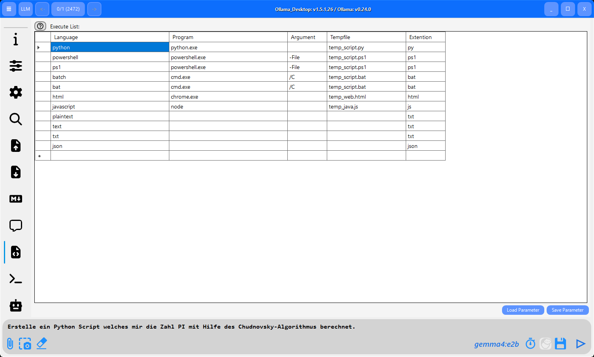
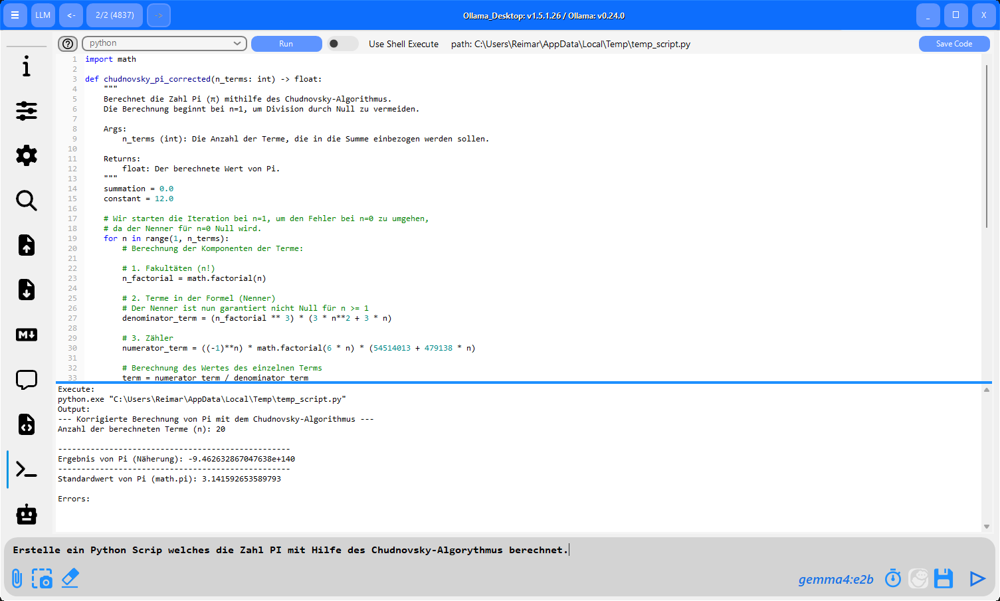

# Ollama Desktop

---

> **Languages:** [English](README.md) | [Deutsch](README.de.md)

---

**Ollama Desktop** is a Graphical User Interface (GUI) for **Ollama**. It allows you to comfortably control locally installed AI models, fine-tune parameters, and enforce structured JSON responses.

---

---

### ✨ Highlights
* **🤖 SSH Bot (Autonomous AI Agent):** Exclusive feature! Transforms the app into an autonomous system administrator that manages servers via SSH, executes commands, and independently reacts to terminal outputs.
* **Vision Support:** Upload and analyze images (.jpg, .png) (e.g., with llava) in Generate mode.
* **Read Files:** Import text files (.pdf, .txt, .json) to include their contents directly into the context.
* **RAG Tool:** Chat with large documents (.pdf/.txt) through local knowledge extraction.
* **Chat Mode:** Model switching during conversation is possible.
* **Tools & Functions:** Local Python code execution by the model.
* **JSON Mode:** Enforce structured responses.
* **Code Execution:** Direct execution of Python, PowerShell, or Batch scripts.
* **Screenshots:** Process screenshots through a Vision LLM.
* **Formula Output:** Display mathematical formulas (LaTeX support).
* **Image Generation:** Support for image generation with models x/z-image-turbo and x/flux2-klein.

---

### 📥 [Download Latest Version](https://github.com/barni007-pro/ollama_desktop_client/releases/latest)

You have the choice between the **Portable** version (no installation required) and the **Setup** version (standard installation).

## 📦 Installation & Setup

### 🚀 Option 1: Portable Version
1. **Download:** Download `Ollama_Desktop_Portable_x.x.x.x.zip` from the [Releases](https://github.com/barni007-pro/ollama_desktop_client/releases) page.
2. **Extract:** Extract the archive into a folder of your choice.
3. **Start:** Run `Ollama_Desktop.exe` directly from the extracted folder.

### 💻 Option 2: Setup Version (Installer)
1. **Download:** Download `Ollama_Desktop_Setup_x.x.x.x.zip` from the [Releases](https://github.com/barni007-pro/ollama_desktop_client/releases) page.
2. **Extract:** Extract the installation file from the ZIP archive.
3. **Install:** Run the setup file and follow the on-screen instructions.
4. **Start:** Open the application after installation via the Start menu or the desktop shortcut.

---

> [!IMPORTANT]
> **Ollama Server:** Ensure that the Ollama server is running (Terminal: `ollama serve`) before starting the desktop client.

---

## 🖼️ UI Overview

  
<b>Click here: View screenshots of all tabs (Click images to enlarge)</b>

| Tab: Model Info | Tab: Model Parameter |
| :---: | :---: |
|  |  |
| **Tab: Tools** | **Tab: RAG Tool** |
|  |  |
| **Tab: Request JSON** | **Tab: Response JSON** |
|  |  |
| **Tab: Response MarkDown** | **Tab: Response HTML** |
|  |  |
| **Tab: Code Parameter** | **Tab: Code Block** |
|  |  |

---

## 🚀 Quickstart

1.  **Start Ollama Server:** Start the Ollama server in the background (Terminal: `ollama serve`).
2.  **Load LLM List:** Click on **Get LLM List** in the top left of the app to load your installed models.
3.  **Select Model:** Choose a model from the dropdown menu (e.g., `llama3` or `gemma2`).
4.  **Execute Prompt:** Enter your question and press the **Play Button (▶)**.

*Tip: Make sure the address in the top left is correct (Default: `127.0.0.1:11434`).*

---

## 🔄 Operating Modes & Vision Support

You can control how the app communicates with the model via the **API** dropdown menu.

### 1. Generate Mode (Single Request)
This mode is designed for one-off tasks (one-shot tasks).
* **Vision / Images:** This is the *only* mode where you can upload images (via the `+ File` or `+ Screenshot` buttons). Use Vision-capable models like *llava* or *moondream* for this.
* **Behavior:** Each request stands alone; the model immediately "forgets" previous questions.
* **Context:** However, you can include context tokens in the next request to maintain a conversation even in Generate mode.

### 2. Chat Mode (Conversation)
The entire conversation history is saved and sent with each new message.
* **Model Switching:** You can **switch the LLM mid-conversation** (e.g., from a fast 7B model to a smart 70B model) without losing the thread of the conversation.

### 🔀 The Bridge: "Generate > Chat"
Since Chat mode cannot receive images directly, the app offers this workflow:
1. Select **Generate** and upload an image (e.g., "Describe this image").
2. Wait for the response.
3. Click the **Generate > Chat** button.
*The analysis is copied into the chat history, allowing you to ask follow-up questions in Chat mode.*

---

## 🤖 SSH Bot (Autonomous AI Agent) — 🌟 Unique Selling Proposition

The integrated SSH Bot transforms Ollama Desktop into a **fully automated Linux system administrator**. Unlike other clients that only generate code, this app can connect directly to your server, analyze problems, and resolve them autonomously!

* **Autonomous Execution:** Provide a goal (e.g., "Analyze the web server and fix the error"). The AI connects via SSH, executes commands, reads the terminal response (including intelligent RegEx detection for the prompt), and independently plans the next logical step.
* **Sudo Support:** The app seamlessly intercepts password requests (`sudo`) and automatically submits the stored password without interrupting the agent's flow.
* **Security Guardrails:** You maintain full control. Limit the maximum agent steps (infinite loop protection) and choose whether the bot can act **fully autonomously (Auto-Execute)** or if it should propose each command for manual approval first.
* **Custom Roles:** Customize the Response and System Prompts to assign specific profiles to the bot (e.g., Security Auditor, Network Admin).

---

## 🛠 Model Parameters

### 1. System Prompt
Define the "personality" of the AI (e.g., "You are an experienced C# developer"). Check the **Use System Prompt** box to send this instruction before every chat.

### 2. Output Format (JSON Mode)
Force the model to respond exactly in a defined **JSON Schema** format. This is ideal for developers who need structured data.

### 3. Content Prompt
This prompt expands the input with attached text-based files like **.txt**, **.json**, or **.pdf**.

### 4. Options Parameters
| Parameter | Description |
| :--- | :--- |
| `temperature` | **Creativity.** `0.0` is deterministic; `0.7-0.8` is natural (default); `1.2+` is experimental. |
| `top_p` | **Nucleus Sampling.** Considers words that reach a cumulative probability `P`. |
| `num_ctx` | **Context Window.** Determines how many tokens the model can process simultaneously. `2048` is default; `4096-8192` for documents. |
| `repeat_penalty` | Prevents the model from repeating words (recommended: `1.1-1.2`). |
| `seed` | A fixed value (e.g., `42`) ensures that the same prompt with the same parameters always returns the same answer. |

*You can manually add custom parameters by clicking on the empty row (marked with `*`) in the table.*

---

## 🛠 Tools & Function Calling
The **Tools** tab turns the LLM into an agent that can automatically perform tasks like weather queries or calculations.
* **Tool JSON:** Define your API interface here so the model knows which parameters need to be extracted.
* **Python Code:** Store the logic that should be executed locally. The app automatically executes this code when the model requests the tool.

---

## 📄 RAG Tool (Chat with Documents)
Upload **.txt** or **.pdf** files to use them as a knowledge base.
* **Workflow:** The app splits the file into sentences, extracts keywords/synonyms from your request, and provides the LLM with suitable text segments as background knowledge.
* **Delta Parameter:** Controls how much context (0-9 sentences) around a hit is sent to the model.

---

## 💻 Code Generation & Execution
Execute code in Python, PowerShell, Batch, or HTML/JavaScript directly in the app.
* **Execute List:** Define your interpreter paths (e.g., `python.exe`) in the **Code Parameter** tab.
* **ShellExecute:** Choose between executing code in the background (output is captured) or in an external window.

---

## ⚖️ Licenses & Third-Party Components
* **Ollama_Desktop, Newtonsoft.Json, Scintilla5.NET, SSH.NET:** MIT License.
* **WebView2:** Microsoft Corporation.
* **Markdig:** BSD-Clause 2.
* **PdfPig:** Apache License 2.0.
* **Siticone.NetCore.UI:** Proprietary License.

---

## ☕ Support
Ollama Desktop is free and open-source. If you would like to support the development, you can donate via PayPal:

**[Donate via PayPal](https://www.paypal.com/cgi-bin/webscr?cmd=_donations&business=r.barnstorf@online.de&currency_code=EUR&source=url)**

Recipient: `r.barnstorf@online.de`